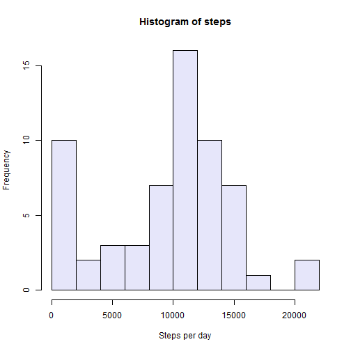
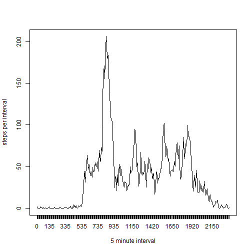
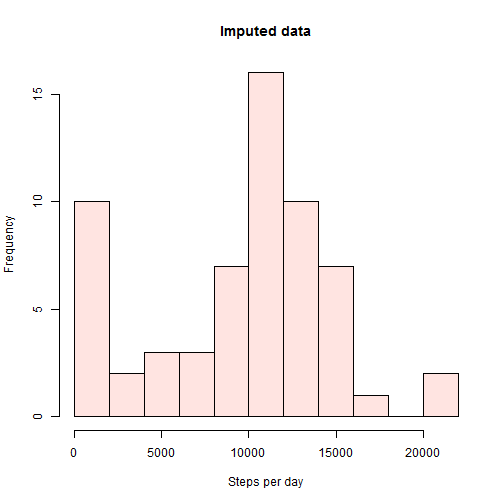
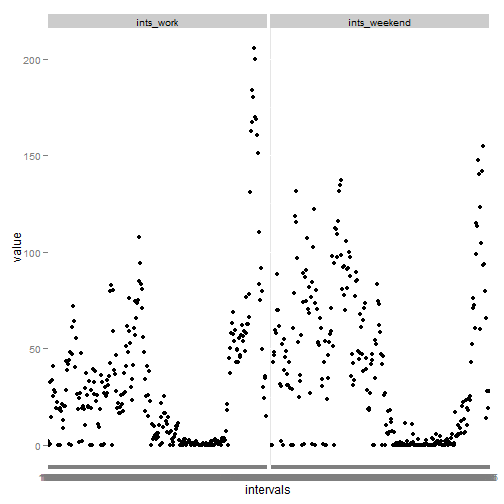

Assignment 1. Personal activity data analysis
=============

## Loading and preprocessing the data


```r
# prepare unzip folder
data_dir<-"activity"
if (!file.exists(data_dir)) {
     dir.create(data_dir)
     }

# unzip
unzip("activity.zip", exdir=data_dir, overwrite = TRUE)

# read into data frame
data<-read.table(file="activity/activity.csv", header=T, sep=",")
```


## What is mean total number of steps taken per day?

```r
# get vector containing total number of steps per each day
steps<-vector()
for ( i in levels(data$date))
{
one_day<-data[which(data$date==i),]
steps<-c(steps, sum(one_day$steps, na.rm=T))
}

# plot histogram of steps 
hist(steps, breaks=15, col="lavender", xlab="Steps per day")
```

 

```r
# look at the mean and median of steps taken per day 
# (among other summary information)
summary(steps)
```

```
##    Min. 1st Qu.  Median    Mean 3rd Qu.    Max. 
##       0    6778   10400    9354   12810   21190
```


## What is the average daily activity pattern?

```r
# get vector containing average number of steps per interval
ints<-vector()
for ( i in unique(data$int))
{
one_int<-data[which(data$int==i),]
ints<-c(ints, mean(one_int$steps, na.rm=T))
}
names(ints)<-unique(data$interval)

# plot obtained vector as time series
plot(ints, type="l", xlab="5 minute interval", ylab="steps per interval", xaxt = "n")
axis(side=1, at=1:length(ints), labels=names(ints))
```

 

```r
# get interval with highest number of steps
names(ints)[which(ints==max(ints))]
```

```
## [1] "835"
```
So we see that at 835-th 5 min interval person's activity is highest.

## Imputing missing values
Lets fill in NAs by calculating the median number of steps per that interval

```r
data_imputed<-data

for (i in 1:nrow(data_imputed)){
    if (is.na(data_imputed$steps[i]) ) {
         temp<-data[which(data$int==data_imputed$int[i]),]
         data_imputed$steps[i]<-median(temp$steps, na.rm=T)}
     
}
# get vector of average number of steps per day from imputed data
steps_imputed<-vector()
for ( i in levels(data_imputed$date))
{
one_day<-data_imputed[which(data_imputed$date==i),]
steps_imputed<-c(steps_imputed, sum(one_day$steps))
}

# plot histogram of steps 
hist(steps_imputed, breaks=15, col="mistyrose", xlab="Steps per day", main="Imputed data")
```

 

```r
# look at the mean and median of steps taken per day for imputed data
# (among other summary information)
summary(steps_imputed)
```

```
##    Min. 1st Qu.  Median    Mean 3rd Qu.    Max. 
##      41    6778   10400    9504   12810   21190
```
thus, imputation had some effect on mean, but did not change the median of data distribution.
## Are there differences in activity patterns between weekdays and weekends?
Adding a column indicating weekday to the imputed dataframe

```r
data_imputed$weekday<-weekdays(as.Date(data$date))
```
adding another factor column to devide days in workdays and weekend

```r
is_weekend<-data_imputed$weekday=="Saturday" | data_imputed$weekday=="Sunday"
work_weekend<-character(length=length(is_weekend))
for (i in 1:length(is_weekend)) {if (is_weekend[i]) {work_weekend[i]<-"Weekend" } else{work_weekend[i]<-"Workday"}}
data_imputed$work_weekend<-work_weekend
data_imputed$weekday<-NULL
data_imputed$date<-NULL
```
prepare data frame for plotting and create plot

```r
# get vectors containing average number of steps per interval for working days
ints_work<-vector()
data_work<-data_imputed[which(data_imputed$work_weekend=="Workday"),]
for ( i in unique(data_work$int))
{
one_int<-data_work[which(data_work$int==i),]
ints_work<-c(ints_work, mean(one_int$steps))
}
names(ints_work)<-unique(data_work$interval)

# get vectors containing average number of steps per interval for weekends
ints_weekend<-vector()
data_weekend<-data_imputed[which(data_imputed$work_weekend=="Weekend"),]
for ( i in unique(data_weekend$int))
{
one_int<-data_weekend[which(data_weekend$int==i),]
ints_weekend<-c(ints_weekend, mean(one_int$steps))
}
names(ints_weekend)<-unique(data_weekend$interval)

# transform and plot data
toplot<-as.data.frame(cbind(ints_work, ints_weekend))
toplot$intervals<-rownames(toplot)
library(reshape)
toplot_m<-melt(toplot, id="intervals")
library(ggplot2)
ggplot(data=toplot_m, aes( intervals, value)) + geom_point() + facet_wrap(~variable)
```

 
